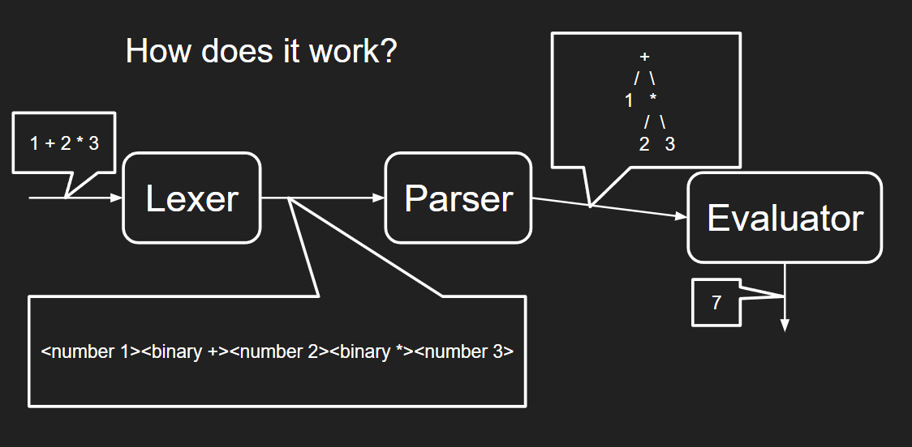

# Arithmetic Parser

Implementation of a simple arithmetic parser in Java

## Run

Maven is required to run the project/

Start by running `mvn install` 
This installs the project and all dependencies.

To run the test, run `mvn test`

To compile the project into a jar executable, run `mvn compile assembly:single`
Then, run `java -jar target/arithmetic-parser-1.0-SNAPSHOT-jar-with-dependencies.jar`

## Pipeline

## Packages

The main package is the `ExpressionAnalysis` package.

It contains the `Arithmetic` package, the `Interface` package and the `Syntax` package along the `Computation` API.

To use the software in a java project, import `org.insane.project.src.ExpressionAnalysis.Computation`
And to process the arithmetic expression, use the `Compute` static method.
`Computation.Compute("1 + 2 * 3) = 7`
